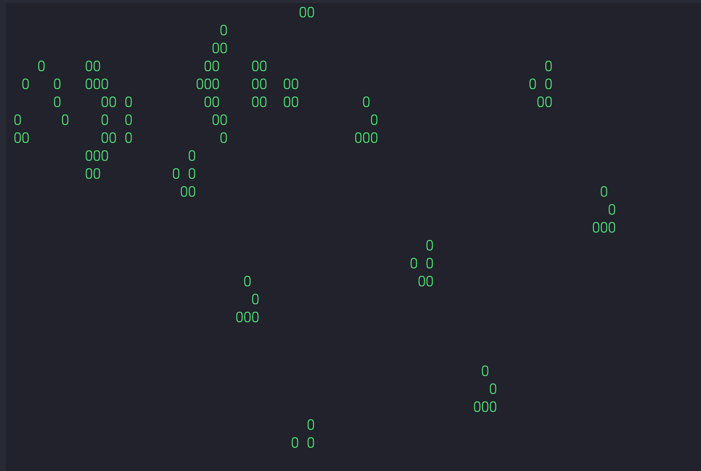

# Game of Life



* [Introduction](#introduction)
* [Goals](#goals)
* [Build](#build)
* [How to Play](#how-to-play)

### Introduction

[Conway's game of life](https://en.wikipedia.org/wiki/Conway%27s_Game_of_Life) implemented in C using [ncurses](https://en.wikipedia.org/wiki/Ncurses)  

### Goals
- Learn basic control structures in C
- Understand two dimensional arrays
- Get better at using [ncurses](https://tldp.org/HOWTO/NCURSES-Programming-HOWTO/)  
### Build

```
$ git clone https://github.com/bezlant/s21_game_of_life
$ cd s21_game_of_life/src
$ make
```

### How to Play

There are presets for the s21_game_of_life in the */maps* folder.<br>To use a preset use input redirection ./build/s21_game_of_life < maps/file.txt. 
<br><u>Or you can make your own preset</u><br> *Have fun!*

* To adust speed press on `1-9`
* To quit press `ESC`
